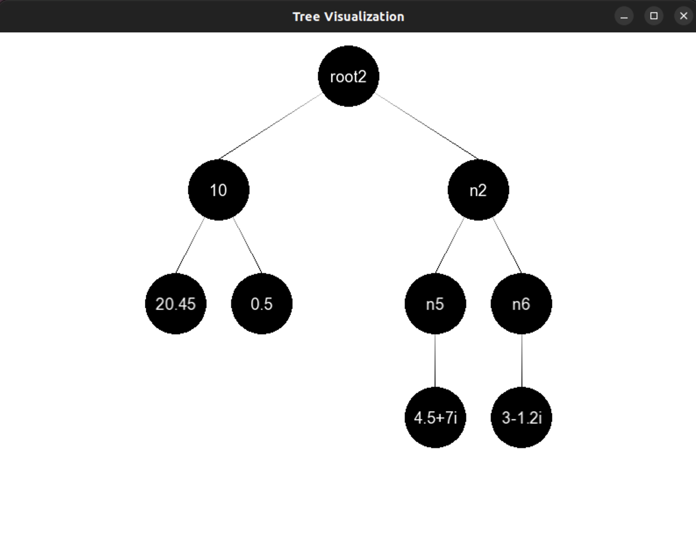

<!-- * Author: Sapir Dahan -->
<!--ID: 325732972 -->
<!-- * Mail: sapirdahan2003@gmail.com -->


# Tree Traversal and Manipulation Project

## Author: Sapir Dahan
- **ID**: 325732972
- **Email**: sapirdahan2003@gmail.com

## Project Overview

This project implements a tree data structure supporting various types of traversals and manipulations, including:
- In-order
- Pre-order
- Post-order
- BFS (Breadth-First Search)
- DFS (Depth-First Search)
- Range-based for loop traversal (which behaves as BFS)

Additionally, the project supports creating a min-heap from a binary tree and working with complex number nodes.

## Features

### Tree Traversals
The project supports several types of tree traversals. If the maximum degree of the tree is greater than 2, the pre-order, post-order, and in-order traversals will switch to a DFS approach.

#### In-Order Traversal
In-order traversal visits the nodes in the following order:
1. Left child
2. Root
3. Right child

#### Pre-Order Traversal
Pre-order traversal visits the nodes in the following order:
1. Root
2. Left child
3. Right child

#### Post-Order Traversal
Post-order traversal visits the nodes in the following order:
1. Left child
2. Right child
3. Root

#### BFS (Breadth-First Search)
BFS traversal visits nodes level by level from top to bottom and left to right within each level.

#### DFS (Depth-First Search)
DFS traversal explores as far as possible along each branch before backtracking.

#### Range-Based For Loop
This traversal behaves as a BFS traversal and allows easy iteration over the tree nodes using a range-based for loop.

### Complex Number Nodes
The project supports nodes containing complex numbers. Complex numbers are implemented with both real and imaginary parts, and their string representations and ASCII values are supported.

### Min-Heap Creation
A specialized function `myHeap` transforms a binary tree (maxDegree = 2) into a min-heap. If the tree is not a binary tree, an error is thrown.

## Usage

### Tree Traversal Demonstration
The `demonstrate_tree` function showcases the different traversals of the tree.

### Creating Trees
Functions are provided to create various sample trees:
- `create_sample_tree`
- `create_another_sample_tree`
- `create_complex_tree`
- `create_string_tree`

Each function returns a `Tree` object initialized with different types and structures of nodes.

### Main Function
The main function demonstrates the creation of trees and their traversals:

```cpp
int main() {
    // Redirect stderr to /dev/null
    freopen("/dev/null", "w", stderr);

    std::cout << "Demo 1:" << std::endl;
    Tree tree1 = create_sample_tree();
    demonstrate_tree(tree1);

    std::cout << "\n\nDemo 2:" << std::endl;
    Tree tree2 = create_another_sample_tree();
    demonstrate_tree(tree2);

    std::cout << "\n\nDemo 3:" << std::endl;
    Tree tree3 = create_complex_tree();
    demonstrate_tree(tree3);

    std::cout << "\n\nDemo 4 (String Tree - Original):" << std::endl;
    Tree stringTree = create_string_tree();
    demonstrate_tree(stringTree);

    try {
        std::cout << "\n\nDemo 4 (String Tree - Min-Heap):" << std::endl;
        Tree heapTree = stringTree.myHeap();
        demonstrate_tree(heapTree);
    } catch (const std::exception& e) {
        std::cerr << "Exception: " << e.what() << std::endl;
    }

    return 0;
}
```

## Example Trees

### Demo 1: Sample Tree


### Demo 2: Another Sample Tree


### Demo 3: Complex Tree


### Demo 4: String Tree - Original


### Demo 4: String Tree - Min-Heap


